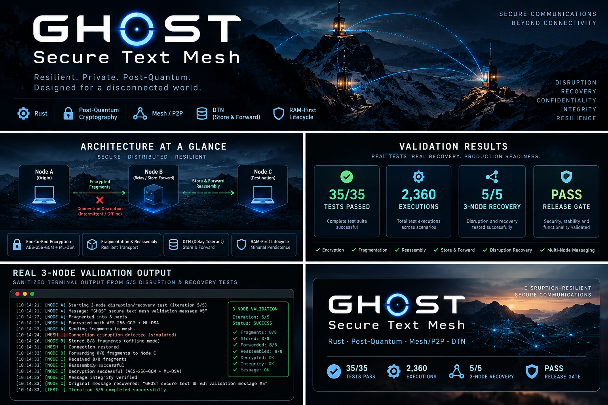
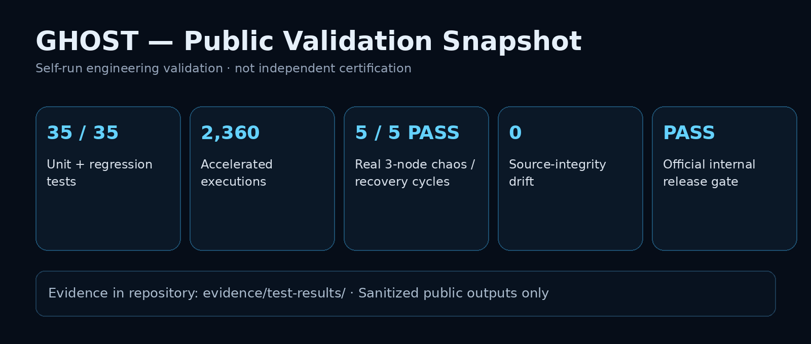
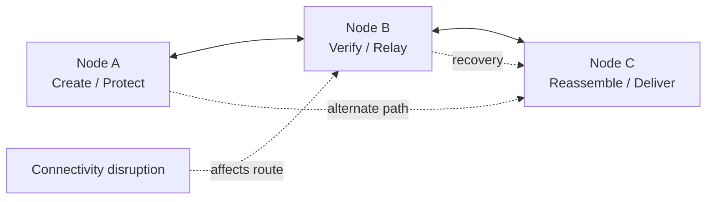
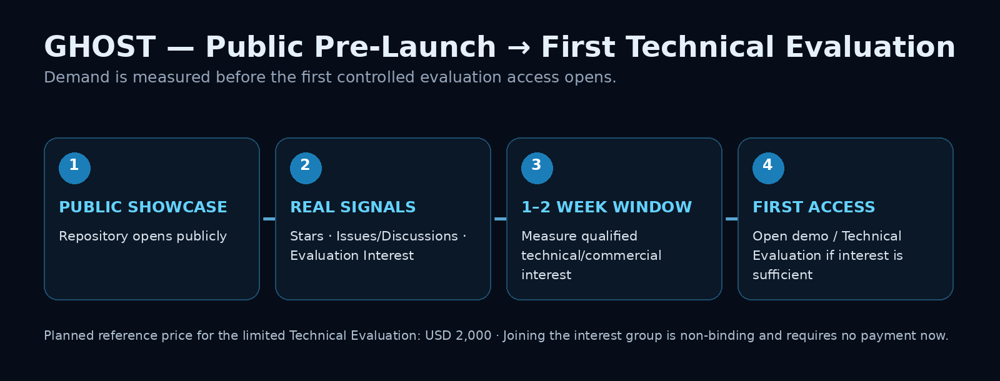

# GHOST Secure Text Mesh



### Secure text communication designed for disrupted, multi-node environments.

**Private implementation · Public technical evidence · Showcase repository**

> GHOST is a Rust-based secure text communication system focused on resilient multi-node delivery, cryptographic protection, disruption recovery, and a RAM-first message lifecycle.

> **Artwork note:** the header image is illustrative showcase artwork. Factual validation claims are the text and evidence files published below.

[Technical Overview](docs/TECHNICAL-OVERVIEW.md) · [Architecture](docs/ARCHITECTURE.md) · [Validation](docs/VALIDATION.md) · [Public Evidence](evidence/EVIDENCE-MANIFEST.md) · [Evaluation Interest Group](INTEREST-GROUP.md)

---

## What GHOST is

GHOST is engineered for environments where a communication system cannot safely assume that connectivity will remain continuous, routes will remain stable, or incoming traffic will always be valid.

### Technology combination

The current GHOST implementation and public system description combine:

- **Rust** as the primary implementation language;
- **Tokio** for asynchronous runtime, networking, and concurrency orchestration;
- **ML-DSA** for post-quantum digital signatures;
- **ML-KEM** for post-quantum key-establishment / encapsulation workflows;
- **AES-256-GCM** for authenticated encryption;
- **Shamir Secret Sharing** for threshold secret-sharing workflows;
- **P2P / mesh-oriented multi-node communication**;
- **delay / disruption-tolerant networking (DTN) behavior**;
- **secure fragmentation and reassembly**;
- **nonce / replay protection**;
- **Proof-of-Work validation controls**;
- **TTL, timeout, rate and resource controls**;
- a **RAM-first message lifecycle** intended to minimize persistent message material.

The production implementation remains private. This repository exists to show the architecture, validation scope, public Rust system model, and observable engineering evidence without publishing sensitive source code or deployment internals.

### Public Rust showcase

A small, non-production Rust example is included under [`examples/rust-showcase/`](examples/rust-showcase/). It demonstrates safe high-level lifecycle orchestration with **Tokio** and public algorithm labels, while intentionally omitting production cryptography, protocol internals, routing logic, secrets, and deployment configuration.

The Python file under `scripts/` is repository preflight tooling rather than product implementation, so it is excluded from GitHub Linguist's language bar through `.gitattributes`. This keeps the public repository language summary aligned with the Rust-based product while remaining explicit about what the published example is and is not.

---

## Real validation output

The public showcase uses sanitized text output from the real validation archive rather than staged screenshots.

```text
=== CLEAN STRICT PRODUCTION 3-NODE E2E ===

=== PRODUCTION MEMORY POLICY ===
memory_lock = true
require_memory_protection = true

=== RUN E2E ===
E2E 3-NODE: PASS
(multi-fragment delivery after disconnect/reconnect + authenticated IPC/admin)

=== E2E EXIT CODE: 0 ===
```

[Open the sanitized 3-node E2E output](evidence/test-results/three-node-e2e-pass.txt)

### Validation snapshot



| Validation item | Recorded result |
|---|---:|
| Unit + regression tests | **35 / 35 PASS** |
| Accelerated executions | **2,360** |
| Real 3-node chaos / recovery cycles | **5 / 5 PASS** |
| Source-integrity drift | **0** |
| Official internal release gate | **PASS** |

[Open the sanitized validation summary](evidence/test-results/public-validation-summary.txt)

> These results come from self-run engineering validation. They are **not** independent certification, formal verification, third-party penetration testing, or government/security accreditation.

---

## Four engineering pillars

### 1. Attack / resource rejection

Tamper, replay, malformed input, bounded allocation and fail-closed controls are part of the validation scope.

### 2. Cryptography

The system combines AES-256-GCM authenticated encryption, ML-DSA signatures, ML-KEM key-establishment workflows, Shamir threshold secret sharing, validation controls and key lifecycle handling.

### 3. Multi-node continuity

The validated flow includes real 3-node operation, disconnect / reconnect behavior and multi-fragment delivery.

### 4. RAM-first lifecycle

The intended message flow is:

```text
CREATE → PROTECT → SIGN → FRAGMENT → TRANSPORT → VERIFY → REASSEMBLE → DELIVER → CLEANUP
```

The design goal is to minimize persistent plaintext, message-key and fragment/share material.

---

## Architecture at a glance



The public architecture intentionally stops at the system boundary. See [Architecture](docs/ARCHITECTURE.md) for the high-level design.

---

## Core capabilities

- Rust-based implementation with Tokio asynchronous orchestration
- Peer-to-peer / mesh-oriented multi-node communication
- Delay / disruption-tolerant networking concepts
- Multi-node end-to-end message transfer
- ML-DSA digital signatures
- ML-KEM key-establishment / encapsulation workflows
- AES-256-GCM authenticated encryption
- Shamir threshold secret sharing
- Secure message fragmentation and reassembly
- Signature and message verification
- Nonce / replay protection
- Proof-of-Work based validation controls
- TTL / timeout controls
- Rate and resource controls
- Firewall / lockdown controls where configured
- RAM-first message handling
- Key lifecycle handling

Public documentation describes system-level behavior only. Production source code, secrets, private keys, exploit-relevant internals, and deployment-sensitive configuration are intentionally excluded.

---

## Public pre-launch and first demo timing



GHOST is being opened publicly first as a **technical showcase and demand-validation stage**. The initial public period is intended to measure real technical and commercial interest before the first controlled demo / Technical Evaluation access window opens.

The planned sequence is:

1. **Public showcase opens** — architecture, sanitized validation evidence, public Rust example, Issues and Discussions become visible.
2. **Real engagement is measured** — stars provide a visibility signal; Issues / Discussions show technical engagement; the **Evaluation Interest** category records the strongest repository-native commercial intent signal.
3. **Initial 1–2 week signal window** — qualified interest is reviewed rather than using a fixed star count as an automatic trigger.
4. **First controlled demo / Technical Evaluation access** — if sufficient genuine interest is confirmed and the release gate remains ready, the first access window will be announced and opened.

The exact opening date is therefore **interest-dependent rather than pre-committed to a calendar day**. A large star count alone does not guarantee release; qualified technical and evaluation interest matters more.

> The planned **USD 2,000 reference price applies to the limited Technical Evaluation access**. Joining the Evaluation Interest Group is non-binding and requires no payment now.

---

## Evaluation Interest Group

A future limited GHOST Technical Evaluation is planned around a **USD 2,000 reference price**.

This repository contains a public, GitHub-native interest group for people and organizations who want to signal genuine evaluation / purchase intent before availability opens.

### Join inside this repository

**Discussions → Evaluation Interest → New discussion**

The structured entry asks participants to confirm that they:

- have seen the planned **USD 2,000** reference price;
- currently intend to consider purchasing the evaluation if it becomes available on substantially the described terms;
- want to remain in the public Evaluation Interest Group while availability is pending;
- understand that joining is non-binding and requires no payment now.

Each participant creates one public entry. The **Evaluation Interest** Discussions category itself becomes the visible group/list. No external waitlist, email form, landing page, checkout, or third-party signup is used.

[Read exactly what joining means](INTEREST-GROUP.md) · [Read the planned evaluation scope](EVALUATION.md)

### Issues remain open

GitHub **Issues** remains available separately for technical, integration, licensing and collaboration questions through the existing `Evaluation / Collaboration Interest` template.

> Do not include confidential, classified, credential, private-key, exploit, or sensitive infrastructure information in public Discussions or Issues.

---

## Intended audience

GHOST may be relevant to professionals and organizations working in:

- Secure communications
- Cybersecurity infrastructure
- Defense and mission-critical systems
- Resilient / disruption-tolerant networking
- Disconnected or intermittently connected environments
- Emergency communications
- Secure edge systems
- Applied cryptography

---

## Repository boundaries

### This repository is

- A public technical showcase
- A high-level architecture reference
- A home for sanitized validation evidence
- A small public Rust lifecycle example
- A public Evaluation Interest Group plus a separate technical entry point for questions

### This repository is not

- The production development repository
- An open-source release of the GHOST production implementation
- A production deployment package
- A repository of private keys, credentials, secrets or sensitive protocol internals
- A claim of independent security certification

---

## Documentation

- [Technical Overview](docs/TECHNICAL-OVERVIEW.md)
- [Architecture](docs/ARCHITECTURE.md)
- [Security Model](docs/SECURITY-MODEL.md)
- [Threat Model](docs/THREAT-MODEL.md)
- [Validation](docs/VALIDATION.md)
- [Public Claims & Evidence Gate](docs/PUBLIC-CLAIMS.md)
- [Public Evidence Manifest](evidence/EVIDENCE-MANIFEST.md)
- [FAQ](docs/FAQ.md)
- [Evaluation Interest Group](INTEREST-GROUP.md)
- [Technical Evaluation](EVALUATION.md)
- [Public Rust Showcase](examples/rust-showcase/README.md)

---

## Project status

**Technical showcase ready · Production implementation private · Public pre-launch / demand validation · Evaluation Interest Group enabled through repository Discussions**

© 2026 GHOST Secure Text Mesh. All rights reserved unless otherwise stated.
